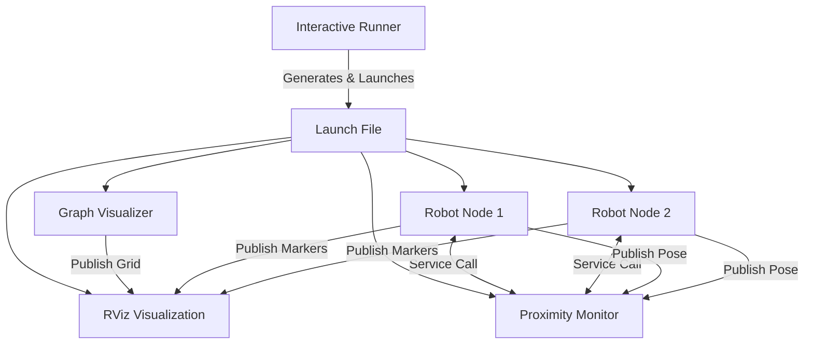

# Project Functionality & Architecture Overview

This project is a multi-robot grid simulation with automated pathfinding, obstacle avoidance, and proximity-based communication.

## 1. Project Architecture

The system is composed of several specialized ROS2 nodes that work together:

---

## 2. Component-by-Component Breakdown

### A. `interactive_runner.py` (The Entry Point)
- **Role**: This is the manual "dashboard" for starting the simulation.
- **Workflow**:
    1. It prints a visual representation of the grid in your terminal.
    2. It asks if you want **AUTO** or **MANUAL** mode.
    3. It collects configurations (e.g., number of robots, custom paths).
    4. It generates a **temporary launch file** that starts all necessary nodes at once.

### B. `graph_manager.py` (The Grid Brain)
- **Role**: Defines the environment geometry and pathfinding logic.
- **Functionality**:
    - **Grid Definition**: Creates a 7x5 grid (Cells A1 to E7).
    - **Obstacle Management**: Stores the locations of non-walkable cells (Red Blocks).
    - **BFS Pathfinding**: Uses Breadth-First Search to find the shortest path between any two cells while avoiding obstacles.
    - **Path Resolution**: If you give a robot a path that goes *through* an obstacle, this component automatically calculates a detour (the "Fix" we implemented).

### C. `robot_node.py` (The Individual Robot)
- **Role**: Manages the life of a single robot (e.g., `robot1`, `robot2`).
- **Functionality**:
    - **Movement**: It moves smoothly between nodes using **Linear Interpolation**. It calculates exactly where it should be at every millisecond to look smooth.
    - **Communication Service**: It hosts a service (`/robotX/communicate`) that other nodes can call to "talk" to it.
    - **Visualization**: It publishes the Colored Spheres, the Range Circle, and the Name Label that you see in RViz.

### D. `proximity_monitor.py` (The Social Coordinator)
- **Role**: Monitors distances between robots and triggers interactions.
- **Workflow**:
    1. It "listens" to the positions of every robot.
    2. It calculates the distance between every pair of robots.
    3. If two robots get closer than the **threshold** (e.g., 3.5 units):
        - It logs "PROXIMITY DETECTED" in the terminal.
        - It sends a command to the robots to "talk" to each other via a service call.
        - It prints the conversation logs in the terminal.

### E. `graph_visualizer.py` (The Painter)
- **Role**: Responsible for drawing the static environment.
- **Functionality**:
    - Draws the dark ground plane.
    - Draws the walkable tiles (Dark Blue) and obstacle cubes (Red).
    - Draws the grid lines and coordinate labels (A1, B1, etc.).

---

## 3. The Full Life-Cycle Flow

1. **Start**: You run `interactive_runner`.
2. **Setup**: You choose 10 robots. The runner creates a "Mission Plan" for each and launches them.
3. **Pathfinding**: Each Robot Node asks the `GraphManager` to "resolve" its path. If a path goes through an obstacle, the robot finds a way around it.
4. **Simulation Start**: RViz opens, showing the grid and the robots at their starting positions.
5. **Animation**: Robots begin moving along their resolved paths.
6. **Interaction**: When `robot1` and `robot5` pass near each other, the `ProximityMonitor` notices. It triggers a message like "Hii this is robot1" and logs it in your terminal.
7. **Adjacency Check**: If a robot ever tries to skip a cell (which would cause it to go through a wall), the safety check we added catches it and ensures it follows the grid lines.
8. **End**: Robots reach their final destination and stop.

## 4. Key Improvements We Made
- **Obstacle Avoidance**: Robots used to "fly" over red blocks. Now they use BFS to walk *around* them.
- **Grid Connectivity**: We moved some obstacles so that there is always a valid path to every part of the grid.
- **RViz Visibility**: We centered the camera so you can see the whole board without manual zooming.
- **Safety**: Added checks to ensure robots never go "off-grid" or jump between non-adjacent cells.
